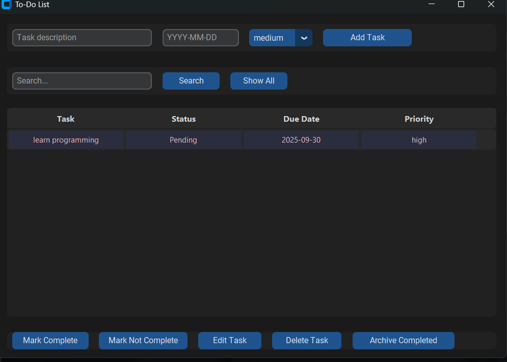
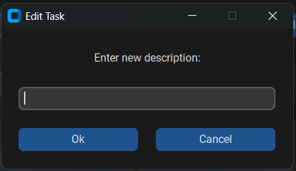

# To-Do List App with Modern GUI

A feature-rich to-do list application with a clean, modern dark-mode interface built using Python, SQLite, and CustomTkinter.

## Features

- Add tasks with descriptions, due dates, and priorities
- Mark tasks as complete or incomplete
- Edit existing tasks
- Search through tasks
- Archive completed tasks
- Responsive, dark-mode interface

## Requirements

- Python 3.7 or higher
- [CustomTkinter](https://github.com/TomSchimansky/CustomTkinter)
- SQLite (included with Python)

## Installation

1. Clone this repository or download the source code.
2. Install dependencies:

   ```bash

   pip install customtkinter

3. Run the app:

   ```bash
   python todo_gui.py
   ```

## Planned Features

- Task categories/tags
- Reminder notifications
- Data export/import
- User accounts system

## Screenshots




## License

This project is for educational and personal use.
